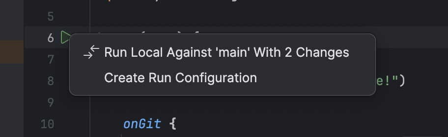
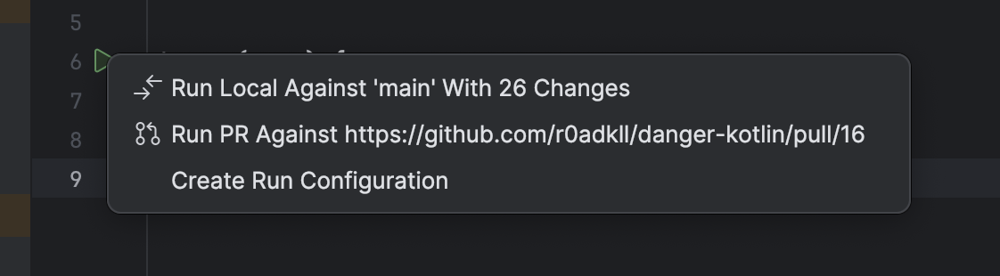

# IntelliJ Plugin

This project provides an IDE plugin to automatically add the Danger kotlin script definition to your IDE so syntax highlighting and auto-complete work out of the box.
The plugin will also detect the `danger(args) { … }` in your scripts and give you a gutter run action, ▶︎, that lets your test your Dangerfiles directly in the IDE.

!!! bug

    All `@file:Import` and `@file:ImportDirectory` annotations are disabled under the hood when editing Dangerfile scripts
    in your IDE. This is due to a bug in IntelliJ breaking when trying to load other scripts into scripts.

    See https://youtrack.jetbrains.com/issue/KTIJ-16352

## Git Integration
As discussed in the [usage][] page you can run `danger-kotlin local` against your local changes in git against a base branch (_i.e. main, master, develop, etc_). The
IntelliJ plugin will automatically detect when you are on a branch with changes against a base branch and give you a run action to test your Dangerfile



## GitHub Integration
The plugin also brings support for the built-in [GitHub Plugin][] that allows it to automatically find the pull request
and authentication information based on your tracked remote branches in Git and provide a run action using `danger-kotlin pr`

This works by matching authenticated accounts server hosts with your git remotes and querying open pull requests that have
the matching HEAD ref as your current tracked remote branch. After this, it will additionally hydrate the run environment with the
GitHub host/api urls and token, i.e.

```
DANGER_GITHUB_API_TOKEN
DANGER_GITHUB_API_BASE_URL
```

Here is an example of how this looks:



## Installation
You can install the plugin directly from the Jetbrains marketplace online or in your IDE.

Check it out in `Settings > Plugins > Marketplace`

or

<iframe width="384px" height="265px" src="https://plugins.jetbrains.com/embeddable/card/26699"></iframe>

[usage]: usage.md
[GitHub Plugin]: https://plugins.jetbrains.com/plugin/13115-github
